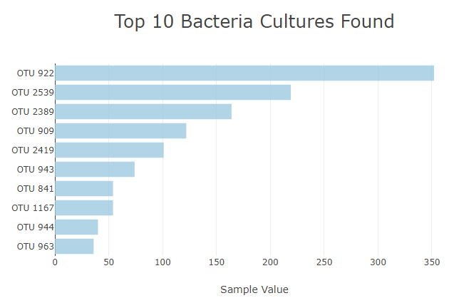
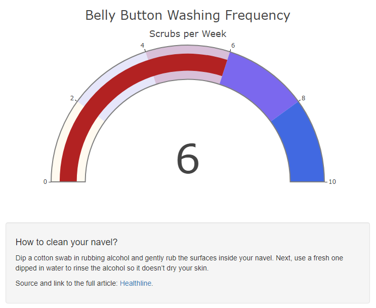
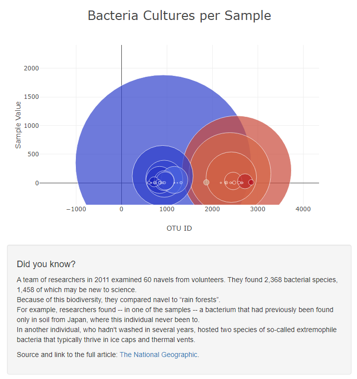

# Plotly-and-Belly-Button-Diversity

### Overview / Results 

  - This week I assisted Roza in visualizing data with a few different graphs on a very specific subject. The subject we are looking at is specifically the biodiversity of bacteria inside of belly buttons! She has a large file of data from her tests so that is where we started cleaning / organizing. We needed to visualize the bacterial data of each volunteer, translate that into a webpage and then make it interactive so anyone viewing the webpage can pick and choose each volunteers data and compare. We came out with lots of interesting results with a very neat and organized page that is easy for anyone to navigate! In all I believe we hit the mark for this project. Below I have included just a few screenshots displaying each graph we have on the webpage. 

